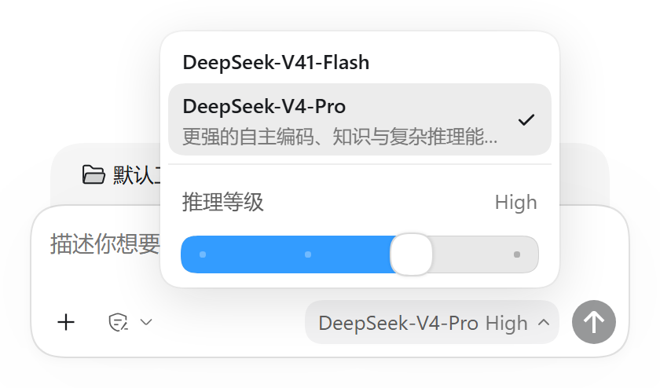
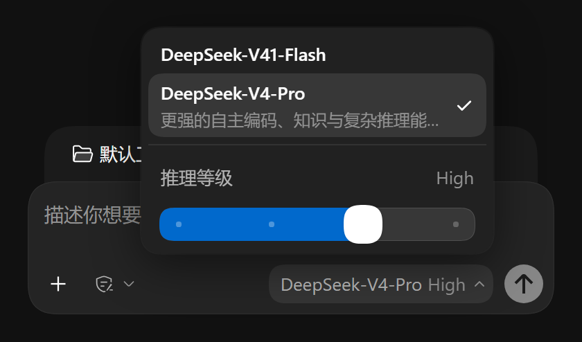

<p align="center">
  
</p>

<div align="center">

  # codex-ui

  **让 DSH Web 呈现 Codex 的外观：窗口边缘、侧栏分界、模型选择器与推理功率轨、输入区、主题色**

  [English](README.md) · [更新日志](CHANGELOG.zh-CN.md) · [MIT](LICENSE)

  [](LICENSE)
  [](https://github.com/deepseek-ai/deepseek-harness)
  [](https://nodejs.org/)
  [](https://github.com/rinDBeans/codex-ui/actions/workflows/ci.yml)

</div>

> codex-ui 是社区维护的 DeepSeek Harness（DSH）界面插件，并非 DeepSeek AI 官方产品。

DSH Web 的界面元素按 Codex 复刻：窗口边缘的阴影与发丝线、侧栏分界线、模型与推理等级菜单、输入区结构、浅色与深色主题色。取值来自 Codex 实机截图与取色面板，逐像素测量，测量过程写在 README 的「实测值」一节，参考图存在 `assets/reference/`。

## 宿主兼容性

本工作区对照 DSH `0.1.7-rc.1`（npm 全局安装）与 `0.1.7-rc.2`（Windows 桌面壳的 `app.asar`）开发；
0.7.0 的全套验收在 npm 发布的 `@deepseek-ai/dsh@0.1.7-rc.2` 上跑（夹具读它的 `node_modules` 与由它打包的 `app.asar` 各一遍，
真 GUI 用它起的 `dsh web`，见「宿主与浏览器」）。夹具直接读宿主 shipped 的 CSS 与渲染代码，宿主升级后若结构变化，夹具断言会失败。

## 功能

| 编号 | 内容 |
|---|---|
| ⑳ | **模型选择器 B 面**（默认开）：自建组件顶替 composer 的模型位 —— 模型列表（按提供方分组、带说明）+ Codex 推理等级**功率轨**（24px 轨 / 4px 档位点 / 28px 白拇指，真拖拽、←/→/Home/End，档位来自数据）；往返期间乐观显示新档并转圈、列表不清空（乐观值优先取宿主的 `pending`，宿主没给就用席位自己记的那一笔 —— 0.1.7-rc.1 就没有这个字段）；**滑杆形态对齐 dsh-claude-style**（槽 26px/8px 圆角、填充 26% 墨、旋钮 16×30、槽下 更快/更强 一行），**顶档换成紫色点阵**（5 行 hash 散相方块，亮 #8b7ad0 / 暗 #9d8ce0，`prefers-reduced-motion` 与脚本的 `data-reduced-motion` 都会让它停）；触发器档位文字模糊交叉淡入。设置里可关 |
| ⑫ | 模型选择器 A 面（关掉 ⑳ 时的宿主原生菜单）：不透明白菜单（圆角 18px）、行高 28px、行圆角 13px（同心：18 − 内衬 5）、勾选列常驻、pending 转圈 |
| ⑬ | 输入区顶栏消隐、面板按钮保留官方图标 |
| ⑬c | 顶栏两格**放开**：注册在两个槽里的条目恢复渲染（子代理后代计数 / jobs roster / 预设徽标 / 在应用中打开）；视图页签仍隐去。条目本身条件渲染，所以常态顶栏与放开前一致 |
| ⑬d | **「轨迹」视图的退出出口**：⑬ 隐去页签条之后，「轨迹」只剩入口没有出口 —— 工具卡展开后的 Inspect 走 `openView('trajectory', callId)`，回来的路却只有那条页签条。轨迹视图显示时在视图区左下角浮一个「← 对话」，点击就是**点那一格页签本身**（与用户手点同一条 `selectView` 回调，不绕宿主内部 API）。结构在 `src/client/trajectory-exit.js`，外观在 `skins/codex-ink/trajectory-exit.css`。「对话是哪一格」先按 `aria-selected` 标定、再按页签文字兜底，两者都没有就**不出按钮**；页签条哪天重新可见本层自动让位。任何一步与宿主结构不符都只 warn 并跳过 |
| ⑭ | 输入卡：圆角（卡片 20/25，上栏条 = 卡片同值）、阴影、几何、工具条、hero 布局 |
| ⑯ | 右栏展开选择组件：无描边无底色、行高 52px、图标 20px、快捷键灰底 pill |
| ⑰ | composer 底部控件：加号默认无底色框、悬停才填；模型与权限控件同套悬停胶囊，且与加号一样是**全圆角**（Codex 参考图实测 R = h/2） |
| ② | 侧栏配色对齐 Codex 亮色侧栏；侧栏列对齐工作区列表行 |
| ②c | 会话窗口边缘：0.5px 发丝线加 24px 全向环境影 |
| ②d | 右栏面板：左沿只留发丝线、影只往上泄；压掉 dockkit 的 1px 深边框 |
| ②e | 右分界线拖拽柄：悬停时中段最深、两端淡出的渐变 |
| ⑱ | 插件管理 → codex-ui 组合包页的设置卡：主题 / 强调色 / 背景 / 前景 / UI 字体 / 代码字体 / 半透明侧边栏 / Codex 模型选择器 / 对比度 |
| ㉑ | **设置模态框全页 Codex 化**：设置对话框换成分组侧栏（「← 返回应用」一行、按文字过滤宿主条目的搜索框、分组标题）、内容区页头、每个子页面的白卡细边与贴底保存栏。结构在 `src/client/settings-modal.js`（只用宿主锚点，宿主节点绝不移动或克隆；隐藏态靠耐久的 `data-*` 属性），外观在 `skins/codex-ink/settings-modal.css`。任何一步与宿主结构不符都只 warn 并跳过 —— 这一层会降级，绝不抛 |

## 界面

浅色：会话窗口边缘与右栏。


输入区底栏：默认无框，悬停出胶囊。


模型选择器 B 面（真 `dsh web` 实例截图）：模型列表 + 推理等级功率轨，亮 / 暗。

<p> </p>

关掉 B 面时，宿主原生菜单（A 面）的 pending 状态。


## 安装

标准的 DSH 插件安装，不需要本仓库的任何脚本：

```powershell
dsh plugin --profile web add link:<仓库绝对路径>   # 加 link 依赖，并把包名写进 dsh.profile.bundles
dsh web
dsh plugin --profile web remove codex-ui          # 卸载：依赖与 bundles 条目一起去掉
```

不想动日常 profile，先建一个试用 profile：

```powershell
dsh codex --from-default-profile web --dump-config   # 由 web 模板建出 codex profile
dsh plugin --profile codex add link:<仓库绝对路径>
dsh codex --port 3099 --no-open
```

桌面应用的 profile 由应用独占，CLI 会拒绝写入：在应用里打开侧栏「插件」→「添加插件」，填仓库绝对路径
（对话框接受包名、Git 地址、压缩包或本地绝对路径）。`@deepseek-ai/schemastery` 声明在 `peerDependencies` 里，由宿主提供。

`link:` 指向仓库本身：改完样式或组件跑一次 `npm run build`，刷新页面即生效；改了 `index.js` 的 `Config` 要重启 `dsh web`
（宿主半在启动时加载）。

**从 0.6.0 及更早版本迁移**：`install-plugin.mjs` 已删除。它装出来的是 `profiles/<name>/vendor/codex-ui` 副本加
`node_modules/codex-ui` junction，注册方式是 `dsh.profile.bundles` 里的包名或 profile `cordis.patch.yml` 里手写的 `- insert:`。
换成标准安装前先把这些删掉 —— 同一个 id 注册两次，市场校验会判 fail 并把插件停用。

同一份样式正本也可由皮肤加载器收录：

```powershell
node scripts/install-skin.mjs          # 与 $DSH_HOME/skins/codex-ink 逐文件 SHA256 比对
node scripts/install-skin.mjs --write  # 有漂移则覆盖
```

## 开发

```powershell
npm run build                    # 由 skins/codex-ink 与 src/client 重新生成 theme.css 与 client.js
node scripts/build.mjs --check   # 只比对产物是否过期，不落盘
```

构建零依赖，只有 `scripts/build.mjs` 一份实现：九份样式去注释、作用域化到 `html[data-codex-ui]`，写出 `theme.css`；
`src/client/` 的 ES 模块按依赖顺序打成一个经典脚本 `client.js`（DSH 的 `__ModuleLoader__.load` 形态，样式内联在里面，
`react` 等宿主包走 loader 给的 `require`）。只认两种 import（`import { a, b as c } from '…'`、`import * as ns from '…'`）
和三种 export（`export const | function | class`），其余写法构建直接报错，不会悄悄打错。

加功能：`src/client/` 下加一个模块导出 `installXxx(ctx)`，在 `src/client/index.js` 的 `apply` 里加一行；
要新样式就在 `skins/codex-ink/` 加一份 CSS，登记进 `scripts/build.mjs` 的 `SKIN_PARTS`。必需的宿主服务写进 `inject`
（缺一个插件就不激活），可有可无的走 `ctx.inject([...], cb)` 子作用域，参照模型选择器。

## 目录

| 路径 | 内容 |
|---|---|
| `index.js` `cordis.patch.yml` `package.json` | 插件宿主半（`Config` 设置结构）与清单 |
| `src/client/index.js` | 浏览器半入口：`inject` 与 `apply`，按序装配下面各项 |
| `src/client/stylesheet.js` | 注入皮肤样式（`style[data-plugin]`，卸载与热更新时由宿主收走） |
| `src/client/settings.js` `theme-preview.js` `settings-card.js` | 设置：覆盖层 `<style>`、主题本地预览、组合包页那张配置卡 |
| `src/client/settings-modal.js` | ㉑ 设置模态框结构层：分组侧栏、搜索过滤、页头、属性优先的隐藏。只用宿主锚点 —— 宿主节点从不搬移或克隆，任一步与宿主结构不符都只 warn 并跳过 |
| `src/client/override.js` | 覆盖层纯函数（无 DOM，`check.mjs` 直接单测） |
| `src/client/model-picker/` | 模型选择器 B 面：`index.js` 等 `modelDirectories` 服务，`component.js` 是席位顶替、弹层与功率轨，`view.js` 是纯函数（`check.mjs` 单测） |
| `src/client/trajectory-exit.js` | ⑬d 轨迹退出出口：浮一个「← 对话」，点击就是**点那一格页签本身**（与用户手点同一条 `selectView` 回调，不碰宿主内部）。「对话是哪一格」先按 `aria-selected` 标定、再按页签文字兜底，两者都没有就**不出按钮** |
| `src/client/constants.js` `host.js` | 共用的名字、读宿主服务的小工具 |
| `skins/codex-ink/` | 样式正本（skin.css / patches.css / model-picker.css / sidebar-align.css / sidebar-surface.css / window-shadow.css / composer.css / settings.css / settings-modal.css / trajectory-exit.css）与 Skin v2 清单 |
| `theme.css` `client.js` | 生成物，由 `scripts/build.mjs` 写出并提交（DSH 加载的是 `client.js`） |
| `scripts/build.mjs` | 作用域化与打包 |
| `scripts/check.mjs` | 不依赖宿主的仓库体检，CI 入口 |
| `scripts/verify.mjs` `scripts/specs/` | 夹具验收：宿主 shipped 样式 + 复刻 DOM，在无头 Chromium 里断言 |
| `scripts/live/` | 真 GUI 验收：`gui.mjs`、`settings.mjs`，以及 `parity.mjs`（改动前后逐元素计算样式对账） |
| `scripts/lib/` | 找宿主与浏览器（`host.mjs`）、CDP 驱动（`cdp.mjs`）、断言汇总（`checks.mjs`） |
| `scripts/install-skin.mjs` | 皮肤加载器路径的同步器 |
| `docs/` | 计划、侦察报告与决策留档 —— 哪些是现行、哪些是历史记录见 `docs/README.md` |
| `assets/reference/` | Codex 实机参考图 |
| `assets/screenshots/` | README 用图 |
| `.github/workflows/ci.yml` | CI |

## 验收

| 命令 | 覆盖 | 前置 |
|---|---|---|
| `npm run check` | 语法、JSON、清单与 `peerDependencies`、产物与源码同源、`client.js` 的 DSH 插件契约（隔离执行一遍）、作用域化、覆盖层与功率轨纯函数、36 组 WCAG、彩色白名单、编码、双语文档成对、机器专属路径、设置模态框契约（源文件 / 作用域化 / 宿主锚点优先 / 装配），67 项 | 无 |
| `npm run verify` | 全部夹具，224 项（见下表） | 宿主包 + Chromium |
| `node scripts/live/gui.mjs --url <带 token 的 URL>` | 真 GUI：阴影与两条分界线，加模型位 —— B 面开着时 14 项（顶替、几何、键盘改档写进宿主 store 并改回），关着时 10 项（A 面 pending 窗口；`--latency` 默认给往返加 800ms，本机往返 <60ms 采不到） | `dsh web` 实例 |
| `node scripts/live/settings.mjs --url <…>` | 真 GUI：组合包页设置卡、9 行结构、默认不覆盖、开关与强调色写入、模型选择器关掉后宿主那一格复原、刷新后仍在、主题切换逐帧无中间帧；结束时全部重置，30 项 | 同上（profile 需启用插件管理） |
| `node scripts/live/settings-modal.mjs --url <…>` | 真 GUI：㉑ 的结构层与视觉层一起验 —— 分组侧栏、「← 返回应用」行、搜索过滤、分组标题、宿主节点同一性（不搬移不克隆），以及宿主重写 `className` 后仍生效的属性优先隐藏。需要启用了插件管理的真 `dsh web`；`--explore` 只导结构不断言 | 同上 |
| `node scripts/live/settings-sweep.mjs --url <…> --out <目录> --prefix c1` | 亮暗各扫一遍全部设置页，逐页截图并量版面健康度。**一页都没扫到就是硬失败**（非零退出）：空扫绝不能报 PASS | 同上 |
| `node scripts/live/parity.mjs snap --url <…> --out <目录>`<br>`node scripts/live/parity.mjs diff <改前> <改后>` | 14 个界面状态逐元素存下全部计算样式再逐项比，0 差异时退出码 0；重构靠它证明外观没变。`--ignore` 可跳过指定属性或新加的 `--变量` | 同上 |

夹具：`node scripts/verify.mjs [spec…]`，不写 spec 就全跑。

| spec | 小节 | 覆盖 | 项数 |
|---|---|---|---|
| `composer` | composer-shadow · hero | ⑱ 输入卡阴影**按实测像素拟合**（两层：环 + 近场；逐层几何与 alpha、暗色 inset、宽窄屏一致、渲染像素）；⑬⑭⑰ 与焦点环、顶栏两格放开、徽标配色与圆角改读令牌计算值 | 21 + 25 |
| `elevation` | elevation | ⑲ `--dsw-elevation-*` 与 Codex 源码对账，外加渲染出的菜单面板 | 19 |
| `model-picker` | host-menu · power-rail | ⑫ A 面宿主菜单与 pending 指示器；⑳ B 面：席位顶替与复原、几何、拖动中不提交 / 松手对齐提交一次、慢往返不回弹且转圈、键盘四键、焦点环、Escape、换模型带默认档、失败提示、**顶档紫色点阵**（5 行、8 档色调桶、相位 hash 散开、羽化、两条关动效口子）、reduced-motion、深色、开关。假目录按**安装中的**宿主形状写（快照里没有 `pending`） | 20 + 62 |
| `rightbar` | rightbar | 阴影层、右栏三件套、两条分界线 | 42 |
| `sidebar` | align · surface | 侧栏列对齐；侧栏滚动渐隐（Codex mask 斜坡）的机制与逐像素 alpha | 6 + 13 |
| `sidebar-color` | sidebar-color | 侧栏底色对 Codex **实测**像素，亮暗同页：亮 246/233/255、暗 15/31/17（全中性，R=G=B）、各自与主区的档差、层级方向，外加每套一条反例对照 | 16 |

选项：`--host <app.asar | node_modules>` 指定宿主，`--shots <目录>` 指定截图位置（默认系统临时目录下的 `codex-ui-shots/`），
`--verbose` 打印读数。夹具取宿主 shipped CSS 加按渲染代码复刻的 DOM，用 `getComputedStyle` 读值；它没有标题栏条、真实
AppFrame 网格与真 RPC，阴影层、分界线悬停与 pending 反馈由真 GUI 取证。

### 宿主与浏览器

夹具读的是它跑在其中的宿主，按下面的顺序取第一个可用的（显式给出却不存在的路径直接报错）：

1. 环境变量 `DSH_ASAR`（桌面壳的 `app.asar`）或 `DSH_GLOBAL_MODULES`（任何含 `@deepseek-ai/*` 的 `node_modules`）；
2. `scripts/host.local.json`（本机配置，已 gitignore），字段 `asar` / `globalModules` / `chrome`；
3. 扫描桌面壳的常见安装位置与 `npm root -g`。

浏览器取 `DSH_CHROME`，未设时依次找 Playwright 的 Chromium、本机 Chrome、Edge。仓库里不含任何一台机器的绝对路径
（`npm run check` 逐个扫描，含 `client.js` 里 JSON 转义过的形式）。

没有桌面壳时，npm 上的同一批包就够，不必拼 asar：

```powershell
npm install @deepseek-ai/dsh@0.1.7-rc.2 --prefix <临时目录>
$env:DSH_GLOBAL_MODULES = "<临时目录>/node_modules"
npm run verify
```

同一个包也能起真实例（首次运行会建 web profile，之后按「安装」一节加插件）：
`$env:DSH_HOME = "<临时目录>/home"; node <临时目录>/node_modules/@deepseek-ai/dsh/lib/bin.js web --port 3098 --no-open`。
终端打印的带 token 的 URL 就是真 GUI 验收的 `--url`。

## 设置页

官方插件管理的组合包页上那张配置卡（座位 `plugins.bundle.config`，键为**包名** `codex-ui`）。
桌面应用里：侧栏「插件」→「已安装」→ `codex-ui` → 页面上的配置卡；改完即时生效，不需要重启。


深色下同一张卡（主题切到深色后，下面三行自动改为编辑深色那一套，对比度显示深色默认档 60）：


| 面板行 | Config 字段 | 默认 | 落点 |
|---|---|---|---|
| 主题 | —（写宿主 `ui-theme` 的 `preference`） | 跟随系统 | `ctx.theme.setTheme()`：整个应用一起切，与「设置 → 通用 → 外观」同一处 |
| 强调色 | `accentLight` / `accentDark` | 空 = 跟随皮肤 | `--dsw-alias-link`、`--dsw-codex-focus` |
| 背景 | `surfaceLight` / `surfaceDark` | 空 | `--dsw-alias-bg-base` |
| 前景 | `inkLight` / `inkDark` | 空 | `--dsw-alias-label-primary` |
| UI 字体 | `fontUi` | 空 | `--dsw-font-family` |
| 代码字体 | `fontCode` | 空 | `--ds-font-family-code` |
| 半透明侧边栏 | `translucentSidebar` | 关 | 侧栏填充与行填充转半透明 |
| Codex 模型选择器 | `modelPicker` | 开 | ⑳ B 面组件接管模型位；关掉即撤走全部自建节点，宿主原生菜单（⑫ A 面）立刻复原 |
| 对比度 | `contrastLight` / `contrastDark` | 45 / 60 | 文本档位与中性 alpha 阶梯 |

- **主题那一行不是卡片自己的界面状态**：写的是宿主 `ui-theme` 的 `preference`，与「设置 → 通用 → 外观」同一处 ——
  切完整应用一起变，刷新后还在。下面三行颜色编辑的是**当前生效的那一套**（`active.colorScheme`）。
- 但它**不走** `theme.setTheme()`：那一步是「先本地乐观发布、随后 `adopt()` 再从设置文档回读」的写法，
  文档往返慢的机器上会依次画出 新值 → 旧值 → 新值，肉眼就是「黑 → 白 → 黑」。卡片改成**先把偏好写进主题插件
  自己的设置文档**（服务内部 `host.set` 那一次写，同一命名空间 `ui-theme` 与字段 `preference`），
  发布方于是只剩 `adopt()`，一次点击只发布一次；控件用本地暂存保持手感，写入未被接受才退回服务入口。
  那 0.8s 的往返不能白等：浏览器半带一层**本地预览** —— 点下去立刻按目标主题应用
  （写的就是宿主本来就会写的两处：`body[data-ds-dark-theme]` 与 `html` 的 `color-scheme`），
  `theme/change` 带着同一个结果回来时幂等地交还；超过 2.5s 没等到就按真值回滚。
  实测点击→变色：**824ms → 22ms**（中位），且序列仍是「亮×n → 暗×m」两段，没有回打。
- 12 个字段全部 `.volatile()`：设置服务只投影标了它的字段，插件管理页也正是靠这一点认得这个条目 ——
  没有 `Config` 就没有这张卡。
- **空值 = 不覆盖**：默认值下覆盖层输出空串、`data-codex-ui-theme` 属性不出现，所以装上不动一个字时，
  样式层与 0.1.x 逐字节相同（这一条是夹具断言）。模型选择器是结构组件，不走覆盖层：它默认开，
  由 `modelPicker` 这一个开关决定，关掉后席位与宿主原生菜单完全交回。
- 覆盖只写在运行时的一条 `<style>` 里，选择器比皮肤多一个属性（特异性 +1），因此不依赖样式表先后顺序，
  `skins/*.css` 一个字不动。
- 改一下即写、没有保存按钮；文本框回车或失焦提交，写后回读确认落地；已覆盖的行显示徽标与「重置」。
- 对比度是**简化实现**：应用用线性 RGB 混合把文本往 ink 拉、并按常量抬升灰阶；这里只做同一方向的两件事 ——
  文本档位按比例混合、发丝线与中性色调家族按比例缩放（夹在 0.5×–2× 之间）。彩色状态色与 diff 底色不参与，
  免得把调色板搬进覆盖层。
- 半透明侧边栏在 Web 上没有窗口层，只能透出页面底色；深色下侧栏与内容同面，开了看不出差别 ——
  所以开关同时把侧栏行填充转半透明，否则整个开关在深色下完全无声。这是如实记录的差距，不是等价实现。
- 开关打开时设置页背板仍钉为实色侧栏色：设置页是全屏 overlay，背板复用的正是侧栏令牌，半透明会透出压在
  下面的主窗口。
- 画布由皮肤自己画：`html` 与 `body` 在两个主题下都取本皮肤的底色（`html` 那一份用 `:has(body[data-ds-dark-theme])` 跟上 ——
  宿主只把主题标记打在 `body` 上）。切主题后的两帧内关掉全部过渡（`html[data-codex-ui-switching] *`，属性由浏览器半在
  `ctx.on('theme/change')` 时打上）。这两条都是防「闪」：前者堵住「某一帧没人画底」而露出宿主默认画布，后者堵住整页交叉淡出。

## 实测值

### 窗口边缘

`assets/reference/codex-app-reference-1x.png`（1901x1107，DPR 1）：

| 位置 | 切法 | 值 |
|---|---|---|
| 会话窗口左沿 | y=600 | x=340..355 由 238,241,247 渐变到 231,233,239，x=356 单像素 212,215,221 |
| 会话窗口上沿 | x=800 | y=30..45 由 237,242,247 渐变到 232,237,242，y=46 单像素 214,218,224 |
| 右栏面板左沿 | y=600 | x=1437 单像素 237,237,237，两侧纯白 |
| 右栏面板上沿 | x=1700 | y=46 单像素 213,218,224，上方同套渐变 |

发丝线在两份参考图里都是 1 个设备像素，因此写 0.5 CSS px：本机缩放 150%，1px 会栅格化成 2 个设备像素。

| 对象 | box-shadow |
|---|---|
| 会话窗口 | `0 0 0 0.5px var(--dsw-alias-border-l2), 0 0 24px rgba(13,13,13,.05)` |
| 右栏面板 | `0 0 0 0.5px var(--dsw-alias-border-l1), 0 -12px 24px -12px rgba(13,13,13,.05)` |

### 主题色

来源 `assets/reference/codex-theme-light.png`、`codex-theme-dark.png`（Codex 取色面板）。

| 角色 | 浅色 | 深色 | 令牌 |
|---|---|---|---|
| 强调色 | `#339CFF` | `#0169CC` | `--dsw-alias-link` |
| 背景 | `#FFFFFF` | `#111111` | `--dsw-alias-bg-base` |
| 表面（输入卡所坐） | `#FFFFFF` | `#181818` | `--dsw-composer-surface` |
| 前景 | `#1A1C1F` | `#FFFFFF` | `--dsw-alias-label-primary` |
| 悬停底 | `#F2F2F3` | `rgba(255,255,255,.08)` | `--dsw-codex-hover-fill` |

浅色三值来自取色面板 `codex-theme-light.png`；**深色自 0.5.6 起按**两个来源分层**：窗口背景取 Codex 主题取色面板 `codex-theme-dark.png` 上写的 `背景 #111111`，
表面取 `resources/app.asar` 的 `jdi.dark.surface #181818`；前景与 accent 仍取 `jdi`（`ink #ffffff`、`accent #339cff`）。
0.2.0~0.5.5 把这两层并成了 `#181818`，输入卡与背景的落差因此从 Codex 的 18 级掉到 12 级。
深色链接仍是应用的 text-link 令牌 `#0169CC`，没有跟着 accent 走。

深色层级：窗口背景 `#111111` → 侧栏/表面 `#181818` → 层1 `#212121` → 层2 `#282828` → 层3 `#303030`；alpha 家族随之由 `rgba(252,252,252,·)` 抬到 `rgba(255,255,255,·)`
（应用的深色 `--alpha-base` 是 `#fff`）。

### 侧栏配色

来源是 Codex 应用的样式表，不是点采样。**Codex 没有「侧栏色」令牌。** 侧栏是叠在窗口底上的一层半透明
遮罩（`app-shared-*.css`，electron 窗口、左侧板外观非 `content-surface` 时）：

```css
.app-shell-left-panel:not([data-app-shell-left-panel-appearance=content-surface]) {
  background: color-mix(in srgb, var(--color-surface-tertiary) 70%, transparent);
}
```

亮色 `--color-surface-tertiary` 是 `--gray-75` = `#F3F3F3`；叠在白色底上合成
`0.7 × 243 + 0.3 × 255 = 246.6 → #F6F6F6`，与 Codex 截图实测的 246 同值。因为有 30% 是透明的，
**渲染值随窗口背后的底而变**：旧值 `#EEF4F9` 是某次蓝底下的读数，不是基准。

避开文字取样，每套主题各一张：亮色侧栏 **246** / 选中行 **233** / 主区 **255**；
暗色侧栏 **15** / 选中行 **31** / 主区 **17**。两套里侧栏都**比主区低一档** ——
亮 255 → 246、暗 17 → 15 —— 这就是层级，也是唯一的差别。

| 令牌 | 亮色 | 暗色 | 推导 |
|---|---|---|---|
| `--dsw-alias-bg-sidebar` | `#f6f6f6` | `#0f0f0f` | Codex 侧栏，两边同一采样线实测 |
| `--dsw-specific-sidebar-fill` | `#f6f6f6` | `#0f0f0f` | 同一面（同时也是 frame 底与标题栏条） |
| `--dsw-specific-sidebar-nav-item-active` | `#e9e9e9` | `#1f1f1f` | Codex 选中行实测 233 / 31 |
| `--dsw-specific-sidebar-nav-item-hover` | `#f0f0f0` | `#171717` | 侧栏底与选中行的中点 |

暗色的**表面**（卡片坐的那一层）仍是 `#181818` —— 在 Codex 里那是 `jdi.dark.surface`，与侧栏不是一回事。
坐在它上面的输入卡实测 35，与 Codex 同值。

## 边界

- 夹具验证不是登录态截屏。`dsh web` 的 launch token 有存活期且只在进程内。
- headless 单窗口只有前台页签处理 `:hover`，多页夹具把 web 形态页最后打开。
- 模型位的 B 面（⑳）**不注册 slot**：宿主的 `conversation.input.model` 席位照常渲染，组件把自己的触发器追加进同一席位并给席位打上
  `data-codex-ui-seated`，一条子代规则把宿主那一格隐藏（它仍在 React 树里）；撤走触发器时标记一起摘掉，宿主那一格立即复原。
  数据与提交只走宿主的 `ctx.modelDirectories`。Codex 功率轨的三个进阶态
  —— 高亮（未开 Fast）、Fast 模式圆点飞出、超出最大档的紫蓝渐变 —— 未做：DSH 没有 Fast 模式，也没有「超出最大档」这一态；
  触发器上 Max 档的紫色（`--color-chart-purple`）同样不做，它在彩色白名单之外。
- ⑯ 保留宿主页签条：整条隐藏会连带去掉全屏与收起按钮。
- 会话行文字列 40px，比工作区行、新会话、插件行短 2px，来自官方 `Rows.module.css` 的 `.sessionRow .title` margin，未改。
- 顶栏两格自 0.3.0 起放开（⑬·3c），因此**会话顶栏会比参考图多出条目**：只有当会话真有子代理 /
  后台 job / 预设 / 工作目录时才出现，此时它同时是"子代理在跑"的唯一可见面。取舍写在 CHANGELOG。
- `composer.css`、`patches.css`、`sidebar-align.css` 与 `sidebar-surface.css` 使用哈希类名后缀锚点（`[class$=…]`、`[class*=…]`），
  宿主没有对应 `data-*` 的位置只能如此（0.7.0 原始出现次数：composer 9 · patches 9 · sidebar-align 9 · sidebar-surface 2 · settings-modal 3）。sidebar-align 的 9 处
  是同一个锚点 `_collapsed`（侧栏折叠态），替掉原先落在祖先位置的 `:has()`。`model-picker.css` 为 0。
- 选择器不把 `:has()` 放在祖先位置：会话区流式插入节点时，Chromium 要为每个受影响的祖先重配整片子树，
  实测样式重算从 ~0.3s 涨到 4s 以上。剩下的 `:has()` 都在主语位置或只看直接子代；`model-picker.css` 由 `check.mjs` 强制为 0。

## 与 Codex 源码对账

Codex 桌面应用的 webview CSS 在 `resources/app.asar` 的 `webview/assets/app-*.css` 里；公开的 `openai/codex`
仓库是 CLI 与 TUI，不含这套界面。下表取值来自应用 `26.727.4816.0`。

| 值 | Codex | 本皮肤 |
|---|---|---|
| 动效时长 | `--transition-duration-basic: .15s`、`--transition-duration-relaxed: .3s` | `--dsw-motion-fast: 150ms`、`--dsw-motion-slow: 300ms` |
| 缓动 | `--ease-in-out` 与 `--default-transition-timing-function`，同为 `cubic-bezier(.4, 0, .2, 1)` | `--dsw-ease` |
| 焦点环 | `--color-border-focus` = `--blue-300` `#339cff`；深色同色 70% | `--dsw-codex-focus` |
| pending 转圈 | `--animate-spin: spin 1s linear infinite` | `codex-ui-spin 1s linear infinite` |
| 发丝线 | `--shadow-hairline: 0 0 0 .5px #0000001a` | 会话窗口与面板发丝线同为 0.5px 环 |
| 亮色前景 | `--color-text-foreground: #1a1c1f` | `--dsw-alias-label-primary` |
| 控件填充 | `--background-button-secondary-hover`，前景色 8% | 浅色 `#f2f2f3`（实测），深色 `rgba(255,255,255,.08)` |
| composer chip 圆角 | 全圆角胶囊（`codex-composer-chip-hover.png` 逐像素实测 R = h/2 = 21px） | `--dsw-radius-pill`（0.5.0 起显式声明；此前沿用宿主的 `--dsw-radius-sm` = 8px） |
| 功率轨 | `_Track` 24px / 圆角 12 / 前景 10% / `inset 0 0 0 .5px var(--color-border)`；`_Tick` 4px，热区 16px；`_Thumb` 28px 白片 / `.5px` `--color-border-strong` / `0 0 2px #0000001a` | `.codex-mp-track` / `-tick` / `-thumb`，同值；`--color-border` → `--dsw-codex-border`（10% / 12%），`--color-border-strong` → `--dsw-codex-border-strong`（15% / 20%） |
| 功率轨动效 | `.3s cubic-bezier(.23, 1, .32, 1)`，档位变换 `.12s`，拇指首帧 `0s`、16ms 后抬到 `.3s` | 同值（`--codex-mp-*`） |
| 选择器弹层 | 宽 `calc(var(--spacing) * 63.5)` = 254px；入场 `.32s cubic-bezier(.23,1,.32,1) 30ms`，`opacity 0 / scale(.98)` → 1 | 同值；定位照宿主 `place()`：右沿对齐、上方 8px、视口留 12px |
| 字体栈 | —（宿主 `dsh-client-ui-theme` 的 base_css_default） | `skin.css` 逐字声明一次，外观不随宿主版本漂 |

刻意保留的差异：

- 深色基面自 0.2.0 起对齐应用默认值：`jdi.dark.surface = #181818`、`jdi.dark.ink = #ffffff`，层级抬到
  `#212121 / #282828 / #303030`（应用灰阶的 gray-800 / gray-750 / gray-700）。0.1.x 用的取色面板三值
  `#111111 / #FCFCFC` 已不再使用。应用完整灰阶是
  `#0d0d0d / #181818 / #212121 / #282828 / #303030 / #414141 / #4f4f4f / #5d5d5d / #afafaf / #ededed / #f3f3f3 / #f9f9f9 / #fff`。
- 对比度滑块是简化实现（见「设置页」一节），没有复刻应用的 `Rdi + zdi·contrast` 线性混合常量。
- 输入卡圆角 25px 是 `assets/reference/codex-composer-reference.png` 上的实测值。应用 CSS 给多行输入卡 `--radius-3xl`（20px）、
  单行 22px；差额来自截图缩放比，而该比例没有记录。
- 侧栏 280px 由宿主布局决定。Codex 自己的侧栏是 `clamp(240px, 275px, min(520px, calc(100vw - 320px)))`。
- 深色链接保留 `#0169cc`，即应用 `--color-token-text-link-foreground` 的取值；想要 `#339CFF` 现在可以直接在设置页拖强调色。
  应用自身的 `--color-text-accent` 在深色下是 `#99ceff`（`--blue-100`）。

## CI

`.github/workflows/ci.yml` 在 Ubuntu 与 Windows、Node 22 与 24 上跑 `scripts/check.mjs`（已含产物与源码同源比对）。
夹具与真 GUI 验收要宿主与 Chromium，留在本机跑。

## 许可

MIT。