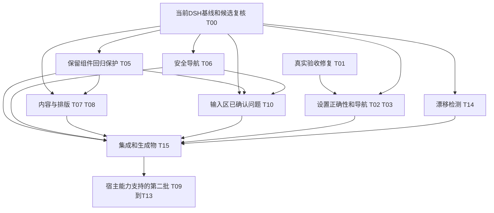

# codex-ui 与官方 Codex 的 UI/UX 差异审查及执行方案

> **状态：现行执行方案；审查日期：2026-09-30（Asia/Singapore）。**
> 项目基线：`codex-ui 0.7.1`，提交 `7186447`。本文件用于交给其他 agent 实施；本轮只新增审查文档，没有修改产品实现。
> **用户修订：DSH相关截图已经过时，宿主已有大量更新；当前模型选择器与推理强度胶囊是用户认可的设计，完整保留，不属于本轮改造对象。本文已同步删除强制改回官方控件的要求。**
> **第二轮审查修订（2026-09-30）：** 按“防御性设计逐条对场景”复核，删除/降级无证据项、合并重复表述：§6.1 删“离线”态；§7.2 能力表收窄、选择器原则改标“既有实践”；UX-01 验收删“卸载期间”（disposed 守卫已覆盖）；UX-12 删“迟到确认不盖掉新事务”（单槽 preview.scheme 比较已防住，待复现再补）；UX-16 删“可取消无效草稿”；§10.1 视口 768×1024 降为可选；A07–A10 合并为一条只读记录；A19 删与 A01 重复的残留预览断言；A24 改为可测断言；T14 由“新增 audit-host.mjs”改为并入现有 check；T02/T03 合并验收矩阵。

## 0. 执行约束与基线复核

1. **保留模型选择器与推理强度胶囊。** 触发器、列表、弹层、胶囊/轨道、尺寸、颜色、动效与现有交互均以当前项目为准。不得改成官方圆旋钮，不移除当前点阵，不修改THUMB_SIZE，不通过共享token或通用样式顺带改变它们。相关代码审查发现仅留作观察，不自动授权组件修复或重写。
2. **旧DSH截图只作历史档案。** 不用它们判断当前宿主的信息结构、功能缺失、密度或视觉质量。先核实用户当前使用的宿主版本、插件组合和布局，再采集新的真实GUI；上一轮读取的0.2.0-rc.2只是当时安装包的证据，不保证代表执行时的环境。
3. **先复核，再确定改造项。** T00是所有视觉/功能候选的前置门槛：当前宿主已满足的项标“已满足，无需改动”；未验证的项保持“待核实”；只有新基线确实存在问题时才执行对应改造。源码分支错误和专项夹具发现保留，但修复前仍核查当前源码与宿主条件。
4. 整体参考Codex的工作流与界面组织，同时保留用户认可的定制。与官方存在差异本身不等于缺陷。

## 1. 审查结论与目标

项目已经把主题、窗口边缘、输入卡、模型菜单、侧栏表面和设置外壳做到了比较细的程度。下一轮投入应集中在**交互可靠性、内容组件、宿主升级适配和可重复验收**。继续只调阴影、圆角，无法补齐官方 Codex 的整体使用体验。

有三个需要立即纠正的认识：

1. **参考基准必须按组件记录。** README的源码对账表仍标`26.727.4816.0`，但侧栏与composer部分测量已用过`26.924.2738.0`（见CHANGELOG与composer spec）。本次官方Windows安装包为`26.928.2636.0`，包内应用为`26.928.21956`。不能把仓库概括为“全部基于旧版”，也不能用其中一张旧图代表当前全界面。
2. **现有测试全绿不等于真实流程完整。** 本轮 `npm run check` 为 **67/67**，`npm run verify` 为 **224/224**；但真 GUI 脚本存在路径和期望值漂移，模型夹具主要模拟旧宿主状态。
3. **项目是 DSH 插件，不是完整 Codex 客户端。** CSS 可以统一外观；适配器可以改善现有交互；真实数据、Git、PTY、队列和持久化必须由宿主能力支撑。功能是否存在，必须先查当前宿主服务，不能用“本插件没实现”推出“DSH 没有”。

建议交付目标分两档：

| 档位 | 内容 | 完成条件 |
|---|---|---|
| **本轮推荐执行** | 先更新DSH真实基线，保留两个认可组件；修复范围内的交互缺陷、恢复验收、按复核结果改善内容/设置/导航 | 纳入范围的P1完成；当前宿主已满足的项无需改动；保留组件无回归 |
| 后续增强 | 侧栏组织、完整命令导航、输入上下文、面板布局、字号、更多长任务操作 | 对应宿主接口验证后逐项实现；没有接口的项形成宿主提案 |

不用给“像官方多少百分比”的虚构分数。以“视觉状态是否匹配、动作是否真实、失败是否可恢复”逐项验收。

## 2. 证据范围与使用规则

### 2.1 本轮实际审查了什么

| 输入 | 本轮结果 | 能证明什么 |
|---|---|---|
| `src/client/`、`skins/codex-ink/`、构建/检查/夹具/真 GUI 脚本 | 已读源码与主要契约 | 分支错误、已实现行为、选择器范围、测试覆盖 |
| `assets/reference/`、`assets/screenshots/` | 已查看主要本地图片 | 历史视觉、已保存的对齐依据；不证明最新运行态 |
| 本机官方安装包 `app/resources/app.asar` | 只读元数据与界面 CSS | 当前已安装构建的组件几何和布局变量；不证明账户可用性或最终级联结果 |
| 现行 OpenAI 官方文档 | 已打开核查，链接见相关章节 | 官方工作流、快捷键和能力边界 |
| 本机 DSH shipped 客户端 | 审查时读取`dsh 0.2.0-rc.2`，`ui-theme 0.2.0-rc.2` | 该安装包的属性、槽位与状态形状；用户实际使用的最新环境须重新核实 |
| 静态检查 | Node `v24.16.0`，67/67 通过 | 构建同源、清单、语法、纯函数、选定颜色组合等 |
| Chromium 夹具 | 6 个 spec、9 个 section，224/224 通过 | shipped CSS + 模拟 DOM/服务下的既有断言 |
| 专项故障/交互夹具 | 已复现关闭兜底、对比度重置、模型焦点、主题超时与导航降级问题 | 指定条件下的插件行为；不代表真实宿主发生频率 |
| 登录后的完整 DSH/Codex GUI 并排对照 | **本轮未执行** | 必须作为执行阶段的基线采集任务，不能把夹具截图写成真 GUI 验收 |

**修订后的证据边界：** 以下矩阵中凡涉及DSH当前视觉质量、信息结构或功能是否缺失的判断，均为待真实页面复核的候选。旧截图与“没有专项样式”不能证明新版宿主存在体验缺口；相关任务在T00完成前不得直接实施。

文中的“确认”指源码、安装包或本轮测试直接支持；“待实测”指需要真实渲染、服务或交互才能判断。官方旧链接现会重定向到 ChatGPT Learn 的桌面文档，实施时选择其中 **Codex** 场景，避免把 Chat、Work 专属界面混入工程客户端。

### 2.2 当前官方安装包的精确视觉证据

以下都是包内路径，无需把整份第三方产物复制进仓库。安装目录通过 `Get-AppxPackage *Codex*` 获取；只读 `app/resources/app.asar`，不要修改安装包。

| 包内文件 / 选择器或变量 | 当前值 | 与项目的关系 |
|---|---|---|
| `webview/assets/impl-1c8b0a94e9ce.css` / `._Track_xwb5v_212` | 轨道高 `24px`，圆角 `12px` | 项目当前 26px / 8px；刻意保留，不计待办 |
| 同文件 / `._ThumbInput_xwb5v_116` | `28px × 28px`，`border-radius:50%` | 项目当前旋钮 16px × 30px；刻意保留，不计待办 |
| 同文件 / `._Thumb_xwb5v_12` | 白色圆拇指、0.5px边、`0 0 2px #0000001a`阴影 | 仅记录官方差异，用户选择保留当前设计，不作为改造目标 |
| 当前组件动画 / `._Mask_tex4u_14` | 蓝/紫混合渐变与移动mask | 当前点阵是用户认可的定制，保留；差异不计为缺陷 |
| `webview/assets/app-primary-547a6c7b4fb3.css` / `._ModelPickerDropdownContent_1ndnu_2` | `width:calc(var(--spacing) * 63.5)` | `--spacing:.25rem`，根字号 16px 时为 254px；项目当前仍对齐 |
| `webview/assets/app-shared-342447930c78.css` / `--spacing-token-sidebar` | `clamp(240px, var(--codex-sidebar-preferred-width,275px), min(520px, calc(100vw - 320px)))` | 官方是可调首选宽 + 约束；仓库 README 的 DSH 280px 是宿主基线，不是插件硬编码错误 |
| 同文件 / `--composer-radius`、`--composer-corner-shape` | 默认spacing×5.5 / round，spacing4px时22px；browser分支28px / superellipse(1.1) | 源码20→25px / superellipse(1.5)不同；真实页面复核后才决定是否调整 |

取证文件 SHA256：

```text
impl-1c8b0a94e9ce.css
9bee384ca55c01186f1e1afdb6e28052fb68807f8b1d550cc959d23e88f847c6
app-primary-547a6c7b4fb3.css
658cc9377542b4d04ade79be0ae4f520d9695008cd72fb6db8af58d91d1e0cdd
app-shared-342447930c78.css
916d8fa55c82aedbf6ca0f53eec06274ec9eafe08397bb7e9e495d089781f93d
```

这些值是当前构建的静态证据。最终截图还要记录根字号、窗口尺寸、DPR、系统缩放、主题、语言和布局状态。不要从一张放大后的截图倒推 CSS px。

模型/推理控件的官方尺寸仅作对照留档。执行验收以 §0.1 的保留基线为准，不采用官方24px轨/28px圆旋钮替换它。

## 3. 与官方体验的差异矩阵

| 区域 | 官方当前可确认的体验 | 项目源码证据 / 待核实运行态 | 保留项与复核后的候选动作 |
|---|---|---|---|
| 主外壳 | 在项目/对话/产物间持续工作 | 窗口面与分界已经有细致样式；平台差异部分保留 | 先保留已对齐部分，补完整状态基线与窄窗策略 |
| 侧栏 | 项目和聊天可组织、搜索、置顶、归档 | 插件主要修改色阶、对齐和渐隐；实际组织行为由 DSH 提供 | 核查宿主已有动作，补可发现性、运行/待处理状态与长标题；不要重新造持久化树 |
| 新建页 | 选择工作上下文后开始任务 | 已有hero/工作区相关样式；当前真实页面结构未采集 | 先复核新版实际布局；信息顺序仅在确认存在问题后调整 |
| 模型选择器与推理强度胶囊 | 官方形态仅作参考 | 当前定制是用户认可的设计 | **完整保留，移出改造范围；只做不改变组件的回归检查** |
| 输入框 | 附件、提及、模式和运行上下文共同参与任务 | 加号、权限、模型触发器已对齐；附件/命令等大量继承宿主 | 补附件、长输入、中文输入法、发送/停止/后续消息状态；有接口才暴露模式操作 |
| 对话正文 | 文本、代码、引用与执行反馈形成连续工作流 | 已覆盖标题和 Markdown 色值，组件级排版取证不足 | 做真实长对话基线，统一正文、列表、表格、代码和引用卡 |
| 工具与审批 | 执行进度、等待审批和失败需要用户能看懂、能操作 | 有基础令牌，但缺少工具/审批专项视觉与流程验证 | 做状态驱动内容样式，保护详情、复制、允许/拒绝和轨迹入口 |
| 轨迹导航 | 检查执行信息后可返回对话 | 为隐藏的 tabs 补了浮动返回入口；只有识别成功才挂 | 条件隐藏 tabs；入口或出口不可用时恢复宿主导航 |
| 右面板 | 文件、审查、终端等与对话协同 | 引导列表、页签壳和分界已覆盖；文件/预览/终端内容多由宿主渲染 | 先对齐容器与已有内容；审查范围、行批注、PTY 动作需服务契约 |
| 设置 | 分区、搜索、键盘操作、外观和后续消息行为 | 已全页化、分组和搜索；关闭兜底错误；对比度草稿残留；CSS order 与焦点顺序不同 | 先修正确性，再统一键盘、语言、保存/失败状态和入口 |
| 命令与快捷键 | 可发现、可搜索的全局动作 | 宿主有 `commandUi` 等能力，插件专项覆盖不足 | 使用宿主命令注册表，不创建另一份不可执行的命令清单 |
| 长任务 | 目标、暂停/恢复、后续消息 steering/queue | 宿主当前已有 goal UI 锚点；实际状态与动作仍需逐项核查 | 保留状态可见性；按宿主真实能力逐项接入 |
| 主题 | 主题配置、窗口底、侧栏和控件各有语义层 | 主题分层较完整；旧读数与注释混杂，深色链接需实测 | 按渲染面核查，避免用文档示例一次替换全局色板 |
| 验收 | 操作完成、结果可检查、失败可恢复 | check/verify 全绿，但 live 脚本漂移、旧夹具和缺失元数据 | 修验证链后再改外观，新增真实行为与基线记录 |

官方行为依据：项目和聊天的组织见 [Projects and chats](https://learn.chatgpt.com/docs/projects)；命令和平台键位见 [Commands](https://learn.chatgpt.com/docs/reference/commands)。官方审查面板可检查改动、给行级反馈并选择审查范围，见 [Code review](https://learn.chatgpt.com/docs/code-review)。目标进度与后续消息偏好见 [Long-running work](https://learn.chatgpt.com/docs/long-running-work) 和 [Settings](https://learn.chatgpt.com/docs/reference/settings)。这些能力不自动意味着 DSH 已有对应服务。

## 4. 源码发现、保留项与待复核候选

优先级定义：**P0**＝真实运行中阻塞核心流程或丢失工作；**P1**＝本轮应完成的正确性/高频体验问题；**P2**＝后续完善。目前没有真实 GUI 证据足以判定一个普遍发生的 P0；下列潜在阻塞应优先复现，若复现则提升。

| ID / 优先级 | 证据 | 用户影响 | 改造与验收 |
|---|---|---|---|
| UX-01 / P1 | `src/client/settings-modal.js:280` 的 `requestClose()`：派发 Escape 后，`findPanel() !== null` 就 return，却注释为“Escape 生效了” | Escape 被拦截或未关闭时，返回应用的关闭按钮兜底反而不执行 | 面板已消失才结束（`findPanel() === null`）；仍存在才调用宿主关闭动作。验收覆盖正常 Escape 与被拦截 Escape 两条路径；“卸载期间”已由 `settings-modal.js:283` 的 `disposed` 守卫覆盖，不另列 |
| UX-02 / P1 | `src/client/settings-card.js:248` 起：对比度 `commit()` 只 write，`shown` 永久优先取 drafts；`clear()` 不删除草稿 | 拖到新值再重置后，保存值已恢复，滑杆/数字仍显示旧值；失败后也可能误导 | 成功/失败/重置都协调草稿与权威值；drag→commit→reset 无需刷新就一致，切亮暗和外部更新也一致 |
| UX-03 / P1 | `scripts/live/settings-modal.mjs:66` 仍读取 `src/settings-modal.js` | 当前源码已迁到 `src/client/`，真实设置验收在前置读取时就会报 ENOENT | 修源路径与相关注释；进入 GUI 后确实测试到设置页；没有找到页面必须非零退出 |
| UX-04 / P1 | `scripts/live/gui.mjs:200`要求中列24px影，浅色现值13px；`:222`首档要求14px，当前16px旋钮首档是8px | live与当前实现/fixture不一致 | 只修验证脚本：当前首档按8px基线，不把组件改成28px圆旋钮来迎合旧断言；浅/深影分别验证 |
| UX-05 / 保留，非缺陷 | 项目模型/推理控件与官方形态不同 | 用户明确认可当前设计 | **不改尺寸、形态、颜色、点阵、布局或现有交互；以当前版本建立保留基线** |
| UX-06 / P1 | `settings-modal.js` 使用 `style.order`，源码已承认视觉顺序与 Tab 顺序不同 | 键盘跨分区跳转；视觉扫描与实际焦点位置不一致 | 优先保持宿主 DOM 顺序；只有宿主允许数据层排序时才重排。需要分组时按连续顺序分组；不要用正 tabindex 掩盖问题 |
| UX-07 / P1 | `settings-modal.js:85` 起分组与匹配依赖中文标签，返回/搜索等注入文字也是中文 | 英文环境分组退化为“其他”，插件语言不一致 | 使用宿主稳定 ID；没有 ID 时维护中英映射并保留未知项。语言由宿主 locale 决定，插件自有文案成对 |
| UX-08 / P1 | `patches.css` 无条件隐藏会话 tabs；`trajectory-exit.js` 识别失败时只是不出按钮 | 修复出口依赖多个 DOM 标记；降级后可能再次出现无路返回 | 只有验证宿主 API或可用出口后才隐藏导航；未标定、直接进轨迹、未知语言、重建 DOM 都保留可操作的宿主出口 |
| UX-09 / 观察，排除组件改造 | 上轮宿主状态已有pending、retainedEffort、idle等，夹具主要模拟旧结构 | 兼容验证范围有限 | 可只读核查/补验证记录；不得据此修改用户要求保留的组件；需要实现改动时另列后续建议 |
| UX-10 / P2 | `README.zh-CN.md` 与 `README.md` 的对账/示例仍有旧版本和旧 A 面图片；`screenshots.json` 引用旧图 | 执行者和使用者可能将历史外观当成当前效果 | 完成真实验收后重新截图；给参考图写版本/DPR/缩放/状态元数据，标记历史而非混充最新 |
| UX-11 / 观察，排除本轮修复 | 专项夹具中pending重建模型列表后失焦，Escape监听范围有限 | 指定条件下的行为发现，不代表当前真实使用频率 | 保留证据，T00可复核；本轮不修改模型组件或交互，不作为交付阻塞项 |
| UX-12 / P1 | `settings-card.js:100` 起pendingTheme仅等待preference追平；`theme-preview.js:38` 起超时只回滚页面 | 已复现页面回亮色但分段仍选深色，控件与显示脱节 | 共享主题事务；超时/失败通知卡片清pending、恢复权威偏好并反馈。“迟到确认不盖掉新事务”已由 `theme-preview.js` 的单槽 `preview` + scheme 等值比较覆盖，待复现再补世代号 |
| UX-13 / P1 | `patches.css:14` 起所有a默认蓝色；当前官方普通a继承颜色、语义外链有点状下划线；check36组未覆盖alias-link | 策略与官方不同；默认小字号蓝字静态对比度不足本方案目标 | 区分正文外链/文件引用/导航/菜单动作；正文link与装饰accent分语义；按实际背景检查，保留用户覆盖 |
| UX-14 / P2 | `skin.css:366`起与patches的data-dsh-part元信息契约使用等宽、字距、大写 | 命中的chip/turn-tail等节点可能呈现项目终端风格，需在实际适配器DOM确认；自建模型trigger/row目前font-family:inherit，不能列为已证实等宽问题 | 检查实际命中；普通meta用UI字体，代码/路径/快捷键保留等宽；中文不强制拉字距 |
| UX-15 / 待复核后定级 | `skin.css:334` 起20/25超椭圆输入卡；当前官方默认22px round、browser28px superellipse(1.1) | 静态参数不同，尚未证明当前真实页面有体验问题 | 先采集桌面/浏览器、单/多行状态；只有确认问题后才调整输入卡局部参数；保留两个认可控件及已满足的编辑区/按钮 |
| UX-16 / P2 | `settings-card.js:153` 非法输入直接return；输入有aria-label，但说明无aria-describedby，多个重置同名 | 不清楚为何没保存，读屏缺字段说明/重置上下文 | 加字段级错误和关联说明；重置包含字段名；不能错误报告为“输入无可访问名称” |

专项夹具补充：对比度70保存→重置后显示70/存储已清，随后blur又把70写回。模型鼠标展开后ArrowDown不能进入列表；所有radio均参与Tab；真实方向键定位后程序化click激活该行（同一click handler），pending重建导致失焦，真实Enter/Space激活仍待验证。首次就在轨迹、对话页签改名Conversation时，tabs已隐藏而返回按钮不存在。英文General/Models样本中注入文字仍为中文且均归“其他”。这些是指定条件下已复现的插件行为。

链接静态计算：默认浅色`#339cff` / `#ffffff`约**2.86:1**；默认深色`#0169cc` / `#111111`约**3.50:1**，在`#181818`上约**3.29:1**。最终正文颜色仍需级联/用户覆盖取样；不能宣布所有运行态不合格，也不能把36组通过解释为正文链接全部合格。

以下待执行阶段取证：真实目录的长菜单裁切、中文输入法发送、多轮流式滚动、审批提交反馈、链接最终对比度、主题事务的宿主发生条件、观察器开销、窄窗设置布局。各项验收见§8、§10。

## 5. 目标视觉与交互规范

### 5.1 视觉测量规则

- 同一状态下比较：窗口/主题/字体/缩放/布局相同，区分 CSS px 和设备像素。
- 语义token与组件CSS解释参数来源；真实computed style和同状态归一化截图确认最终级联与视觉。不能用静态token推翻实际渲染；旧DSH截图仅作历史档案，不参与当前差异验收。
- 已对齐且没有新证据的区域保留；每项视觉调整给前后截图和参数来源。
- 主题配置值不是每个元素最终背景。分别采集窗口画布、主区、侧栏、选中行、输入面、输入卡、菜单、设置卡。
- 当前官方 Appearance 文档展示的主题配置与本仓库旧截图并非同一状态，不能据此直接把所有 `#111111` 替换成 `#181818`，或把所有链接改成 accent。

### 5.2 统一但不滥用 token

| 类别 | 本轮规范 | 注意 |
|---|---|---|
| 表面/文字/边框 | 继续用 `--dsw-alias-*`；定义清楚 canvas/content/sidebar/control 的语义 | 不把状态色、代码色和普通文字混成一套 |
| 圆角 | 将自有 `-s/-m/-l` 与宿主 `-sm/-md/-lg/-panel` 的消费关系写清楚 | 有消费者才加桥接，不全局盲改导致第三方控件变化 |
| 内容宽度 | 正文适合阅读，代码/表格可横向滚动，输入框随中心列收缩 | 官方存在 compact/large/single-line/stacked 等状态；一个 max-width 无法涵盖全部 |
| 输入控件 | 模型选择器与推理强度胶囊按当前设计完整保留；其他控件按真实基线复核 | 共享token/通用样式的调整不得顺带改变保留组件 |
| 动效 | 保留有依据的 150–300ms 微交互；长布局变化按实际需求 | 支持系统 reduced-motion；不要把所有 spinner 停止后变成无反馈 |
| 焦点 | 明暗都可见、键盘可达、关闭弹层回触发器 | 不用 outline:none 或正 tabindex 解决外观问题 |
| 字号 | 正文与说明分别设层级；字号调整走宿主主题服务 | 当前 11px 说明文字需评估，不以“官方淡”作为不可读的理由 |

可读性验收目标：普通小文本在实际背景上对比度至少 4.5:1；控制边界/大图形至少 3:1；禁用态和纯装饰另列。这是本项目设计验收目标，不是凭静态 token 检查就宣称全站通过认证。当前 check 部分辅助文字用 3:1 阈值，且没有覆盖所有实际 DOM 和用户自定义主题。

### 5.3 全局状态规则

每个真实异步控件都要明确：**就绪 → 提交中 → 成功 / 失败 / 取消**。乐观状态只能有一份所有者；收到权威值后交回；失败时解释原因、恢复原值并保留可重试入口。

错误信息显示在相关控件附近；严重错误同时保持操作可发现。不要把所有服务错误压成一个长期静默的 console.warn。降级外观可以 warn；执行失败应有用户能读到的反馈。

等待审批、目标暂停、后台任务、模型提交中的状态必须可见。统计信息可以收拢到详情；真实任务状态不能因为参考截图上没有而隐藏。

## 6. 按界面区域实施

### 6.1 外壳、侧栏和新建页

保留窗口面、侧栏渐隐、分界拖拽和 DSH 品牌。侧栏先梳理现有项目/会话/搜索/菜单动作，做稳定的 active、hover、running、attention、unread、archived 视觉映射；没有状态数据的项不自行猜测。

长标题截断时提供可读全称；项目行与会话行区别用缩进/字重/图标，不用大量不同底色。操作菜单在键盘聚焦时也能发现。搜索无结果、空项目、加载失败分别呈现（“离线”态在本插件与宿主中均无证据，已删）。

不要直接将所有 32/34/36px 行改为旧截图“约 42px”。先用统一 DPR 测量；确认宿主的可调侧栏宽度与主列最小宽度；275px 是官方首选参数，不是必须覆盖的 DSH 常量。

新建页以新版真实GUI为起点。只有输入与上下文信息的实际层级存在问题时才调整；保留品牌、工作区信息和获认可组件。建议内容必须可执行，不增加假项目/假模型/无作用按钮。

### 6.2 输入区与保留组件

**模型选择器与推理强度胶囊不改造（约束见 §0.1，此处不重复）。** 对照官方的几何和专项夹具观察只作历史资料，不转换为本轮执行指令。

输入区其余部分先核查新版宿主已有能力。附件、提及、权限和工作区数据沿用宿主；只有真实页面确认存在不足时才调整。周边布局、正文排版或全局token变更均需证明两个保留组件没有被影响。

输入区测试多行、超长 prompt、中文 IME、附件失败/移除、粘贴文本、发送中再次输入和停止。发送键策略使用宿主设置；`event.isComposing` 期间不发送。对 follow-up queue/steer 先查宿主动作，不能把普通发送包装成不存在的语义。

### 6.3 对话、工具、审批和引用

本轮内容组件优先级高于装饰动效。工具摘要展示实际工具名、主要作用/对象、运行状态和必要时长；详情可展开，命令与日志易复制，长输出局部滚动。失败和取消有文字/图标，不只靠颜色。

审批保留完整动作语义：请求内容、作用范围、允许/拒绝、提交中和结果。不能用折叠或全局禁用样式遮掉宿主安全信息，也不能把“本次允许”和“以后允许”混成一个按钮。先审查宿主提供什么，再决定展示。

引用和附件需要文件名、来源、状态和可用动作。菜单样式不代表引用整条链路已经覆盖：建议菜单、composer chip、正文引用、右侧预览都要独立验证。

正文覆盖标题、段落、列表、引用、链接、行内代码、代码块、表格、公式/图表（宿主支持时）。宽表格/长代码只在块内横滚，页面不产生横向溢出。流式新增不能把正在阅读历史的用户拉到底部；有新内容时提供明确返回最新入口。

### 6.4 轨迹与右侧工作区

轨迹入口、当前视图和返回对话一起设计。宿主 tabs 可见时不额外叠加入口；需要简化顶栏时，应使用宿主视图 API 或已验证的适配器能力标记。**能力检测成功后才隐藏 tabs；失败时恢复。**

右面板第一步统一已有文件树、预览、上下文和终端的容器、页头、loading/empty/error、搜索与滚动。保留全屏/收起/关闭按钮和用户当前选中 tab。窗口变窄时减少同时展示的列，不能把中列压到无法输入。

官方终端依附项目/worktree，见 [Integrated terminal](https://learn.chatgpt.com/docs/integrated-terminal)；Local/Worktree/Cloud 的执行环境各有真实语义，见 [Codex environments](https://learn.chatgpt.com/docs/environments/modes)。DSH 的右栏终端已有自身实现，插件可以统一容器；底部布局、worktree 迁移、审查范围和行批注必须确认宿主服务后实施。

### 6.5 设置、命令和可访问性

设置先修 UX-01/02/06/07。返回入口使用原生 button；搜索具有可清除动作和空结果提示；未知插件项保持可达。焦点顺序与视觉顺序一致。关闭后恢复到打开设置的入口，不让焦点落到 body。

即时保存与宿主“保存”操作要区分：本插件配置卡提示“更改即时保存”，使用宿主延迟保存的页面保留保存动作。输入无效值说明原因，不静默忽略；失败不丢草稿，重试与取消有明确结果。对比度、颜色和字体的重置都要清除关联草稿。

设置字段用稳定id连接可见label、说明和错误；重置按钮名包含字段名，如“重置对比度”。主题预览与卡片共用一项事务状态，超时回滚同步更新分段选择。透明侧栏文案需更新：当前深色sidebar为#0f0f0f、surface为#111111，开启后以surface的72% alpha填充，不能沿用“深色看不出差别”的旧说明。

外观配置应有易发现入口，但不能在设置和插件页维护两份独立配置。可添加指向现有配置卡的快捷入口，或在宿主支持时复用同一表单。

命令面板使用宿主注册表及可执行动作，统一搜索、分组、选中、禁用、说明和快捷键。Windows Web 场景先检查浏览器冲突；如 Ctrl+K 被浏览器/终端或宿主使用，不重复全局绑定。快捷键提示必须与实际绑定一致；仅显示的按键不能算功能完成。

## 7. 工程实现边界与能力核查

### 7.1 当前宿主已确认的入口

以下来自本机 `0.2.0-rc.2` 的 shipped 客户端静态扫描。稳定标记代表可以定位，不等于某项业务动作已经验证。

| 模块 | 已确认入口 | 适合做什么 |
|---|---|---|
| tool | `[data-tool]`、`[data-state]`、`[data-variant]`、`[data-chat-call-id]`、`[data-subcalls]`、`[data-expandable]`；`tool.call.toolview` keyed 槽 | 工具状态、摘要、详情、子调用视觉 |
| approval | `[data-approval-key]`、`[data-approval-scroll]`；`conversation.approval.detail` 与 composer 相关链路 | 审批样式和可见性，动作沿用宿主 |
| question | `[data-question-key]`、`[data-question-scroll]`、`[data-question-reply]`、`[data-reply-outcome]`；composer/chat相关槽位 | 需要用户答复时的表单、键盘/IME、提交中和结果，不把请求卡仅按工具日志处理 |
| skill | `[data-tool="skill"]`、`[data-state]`；`tool.call.toolview` 的 `skill` key | 技能工具内容状态 |
| goal | `[data-goal-bar]`、`[data-command-input]`；`conversation.input.dock`、`conversation.chat.node` 的 `command-input` key | 目标行、命令输入状态；具体暂停/恢复先核查服务 |
| reference | 注册`@`输入触发器；实际建议由input-trigger的`[data-trigger-menu]`及source为reference的条目渲染，chip为`[data-composer-chip]` | 跨建议菜单/chip/引用的视觉与交互验收；确认属性实际落在哪层再写选择器 |
| commands | `conversation.input.overlay` 的 `command-popup`、`commandUi` 服务 | 宿主命令菜单的外观与现有动作 |
| session | 服务适配层，本包没有 DOM | 不能因“零锚点”把它当成待造的可见组件 |
| modelDirectories | 当前状态含 `pending`、`retainedEffort`、`idle` 等 | 更新当前契约测试，保留旧结构兼容 |

旧 `docs/next-components.zh-CN.md` 的“50 个包有多少零锚点”和“只有皮肤+设置卡”属于历史调查口径，本轮不能直接沿用。

### 7.2 三层实施方式

1. **样式层**：稳定 data/slot/role + 实际 token 消费者。新增 `content.css`、`overlays.css` 等时登记到 `scripts/build.mjs` 的 `SKIN_PARTS`。
2. **适配层**：只对缺少语义标记或小范围交互做侦察、盖自有 data 属性、注入自有节点；宿主节点不搬移、不克隆；每个安装函数具备完整 dispose。
3. **宿主能力层**：命令、模型、配置、任务、文件、Git 等直接使用已验证服务。可选服务走 `ctx.inject` 子作用域；缺失则保留宿主入口或明确降级。

新增宿主依赖的交互（T07/T08/T11/T12）记录能力表：`capability → service/slot → host version → confirmed state/action → fallback → tests`。不要建立平行模型目录、平行设置存储或平行命令注册表。

选择器原则：稳定语义属性优先；哈希后缀只能集中在兼容适配器并做漂移检测。`[class$="_trigger"]` 会依赖整条 class 属性顺序，不能作为新增组件的唯一身份——这是既有实践（`scripts/live/settings-modal.mjs:433` 已按“类令牌匹配”实现），不是本轮新增约束。

观察器只在需要的根节点观察，合并到一帧，避免每个流式 token 都扫描 document 全树。检测失败时释放注入节点/监听/标记；对隐藏原入口的增强，降级必须恢复原入口，不能只 warn。

`theme.css` 与 `client.js` 是生成物：所有修改从 `src/client/`、`skins/codex-ink/` 开始，最后由集成 agent 构建。构建器支持的 import/export 形态有限，遵循现有代码规范，不引入无法打包的 JSX/TypeScript/新语法。

## 8. 可直接分派的任务单

所有“拟新增”文件是建议路径，不代表本轮已经存在。同一源文件由一个 owner 修改，其他 agent 通过建议/补丁交给 owner；生成物由集成 agent 统一处理。

| 任务 | 优先级 / 依赖 | 修改范围 | 交付与验收 |
|---|---|---|---|
| **T00 更新DSH真实基线与候选复核** | P1 / 所有视觉/功能改造的前置门槛 | `docs/`；新的截图manifest、能力矩阵 | 核实当前使用的宿主/插件/布局，重新采集真实GUI；旧图隔离为历史；逐项标已满足/确认问题/待核实；确认两个保留组件基线 |
| **T01 修复真实验收链** | P1 / 无，可与T00并行 | `scripts/live/settings-modal.mjs`、`gui.mjs`、check输出、相关README | 修UX-03/04；首档保留当前8px基线，不改控件；访问真实页面；缺页面/少状态/空扫非零退出；区分浅/深影 |
| **T02 设置值一致性** | P1候选 / T00、T01 | `settings-card.js`、`theme-preview.js`、`settings.js`；设置live用例 | 按 T00 结论修 UX-02/12/16；重置后blur不重写、超时页面/分段一致、非法值反馈、说明关联；去重提交；更新透明侧栏说明 |
| **T03 设置导航/关闭/语言** | P1候选 / T00、T01 | `settings-modal.js`、`settings-modal.css`；设置 live 用例与 T02 共用一份验收矩阵 | 按 T00 结论修 UX-01/06/07；焦点顺序、关闭 fallback、搜索清空、未知项、英文、关闭焦点恢复 |
| **T04 模型组件改造** | **取消本轮执行** | 不修改模型组件源码/CSS/协议 | UX-09/11只留观察记录；不得以对齐或修复为由重写用户保留的组件 |
| **T05 保留组件回归保护** | P1 / T00 | 仅截图、基线记录和必要验证脚本；不修改产品控件 | 冻结当前模型选择器/推理强度胶囊形态、颜色、动效、布局和交互；其他改动不得影响它们；不改THUMB_SIZE/点阵/轨道参数 |
| **T06 隐藏与降级安全** | P1 / T00 | `trajectory-exit.js`、`patches.css`、入口装配；拟新增导航用例 | 只有出口可用才隐藏 tabs；直接进轨迹/未知语言/DOM漂移/卸载恢复宿主；任务状态始终可见 |
| **T07 高频内容组件** | P1 / T00 | 拟新增`content.css`；必要语义适配器；内容spec/live | 工具/技能/审批/用户问题/目标/引用有真实样本；摘要/详情/等待/失败/取消；按钮/答复可用，状态易识别 |
| **T08 文本与弹层统一** | P1候选 / T00、T05、T07 | `skin.css`、`patches.css`、必要的`override.js`语义映射、拟新增`overlays.css` | 经复核修UX-13/14；长Markdown/代码/表格/语义链接；菜单/tooltip/toast；正文link与focus/accent分开验收，不打断配置覆盖；overflow局部化；共享样式不得影响两个保留控件 |
| **T09 侧栏组织与密度** | P2 / T00 | `sidebar-align.css`、`sidebar-surface.css`；需要时宿主适配器 | 搜索/长名/活动状态/菜单可发现；宽度受宿主控制；真实置顶归档动作先验证 |
| **T10 输入区候选优化** | 复核后定级 / T00、T05、T06 | 模型/推理控件之外的composer区域；必要局部样式/适配器 | 新基线确认问题后才调整输入卡/单多行/附件/IME；保护两个控件；现有功能已满足则不改，不创建假queue/steer |
| **T11 工作区面板内容** | P2 / T00、T08 | 拟新增 `panels.css`，右栏相关样式 | 文件/预览/上下文/终端状态、页头与滚动统一；关闭/收起/全屏原行为正确；窄窗布局不挤死输入 |
| **T12 命令发现与快捷键** | P2 / T00、T08 | 拟新增命令样式/适配器、快捷键用例 | 使用宿主 commandUi 注册表；真实动作、空结果、禁用原因、实际键位和平台冲突验证 |
| **T13 外观入口与字号** | P2候选 / T00、T02、T03 | 设置卡/宿主 theme 服务、主题相关样式 | 更易找到已有配置；同一真源；字号修改/刷新/重置正确；不新增未验证的配置字段；不改变保留控件样式 |
| **T14 漂移和能力检测** | P1 / T00；持续协作 | **并入现有设施**：`scripts/check.mjs` 增加关键锚点断言，沿用 `scripts/lib/host.mjs` 的 `openHost()`；不新建 `scripts/audit-host.mjs`（避免第二条宿主解析路径，违反 §7.2“不建平行注册表”） | 缺失关键锚点则明确失败（`host.mjs:8` 的“显式路径不存在即报错”语义已具备）；未知包只作信息；当前和旧宿主契约均可测；运行时失效恢复原功能 |
| **T15 交付整合** | P1 / 本轮任务完成 | `build.mjs`、入口装配、生成物、双语 README/CHANGELOG、截图 manifest | 单一构建、所有检查、真实关键路径、截图来源和已知限制；改造目标区域按新基线验收 |

先做**T00、T01、T05**。T02、T03、T06–T08、T10、T14、T15按 T00 结论推进（不再重复“先复核”前置）；T04取消。T09、T11–T13是后续候选，当前宿主已满足时直接关闭待办。没有接口的工作形成宿主提案，不做假按钮占位。

## 9. 多 agent 分工与集成顺序



推荐 3 个实现 agent + 1 个集成/验收 owner：

| Owner | 工作 | 避免冲突 |
|---|---|---|
| Agent A：设置与导航 | T02、T03、T06 | 独占 settings/trajectory 源文件；patches.css 修改经集成 owner 合并 |
| Agent B：验收与组件保护 | T01、T05、T14 | 负责验证脚本/基线；不修改模型选择器与推理强度胶囊实现 |
| Agent C：内容 | T07、T08、经确认的T10 | 独立局部CSS优先；不得用共享样式改变保留组件；token改动经集成owner审核 |
| 集成/验收 owner | T00、T15，维护能力矩阵 | 独占build/入口/生成物/最终文档；T00后删去已满足的候选，分配实际改造范围 |

每个任务采用 5 个步骤：现状复现 → 确认契约 → 最小实现 → 对应验收 → 汇报证据。先跑相关 section；集成后完整跑一次。只在新变更、失败或未解决风险出现时重跑，避免无意义重复。

原工期估算撤回。新版DSH已经更新很多，需T00确认真正缺口后再估算；不能把已完成的宿主功能和用户认可的控件算成重做工作。

## 10. 验收矩阵

### 10.1 最少环境

| 维度 | 要求 |
|---|---|
| 主题 | light、dark、system；用户自定义主题至少一组 |
| 视口 | 1280×800、1440×900、1920×1080；960×720 验证窄窗（768×1024 降为可选：现有夹具无此档，不作为必测） |
| DPR/系统缩放 | DPR 1、1.5、2；记录真实系统缩放，避免二次缩放截图 |
| 语言 | 插件自有文案 zh-CN/en；宿主当前支持的语言据实记录 |
| 动效 | normal、prefers-reduced-motion |
| 宿主 | T00确认的当前实际宿主/插件组合为主；0.2.0-rc.2仅是前次包/夹具证据；README声明兼容的旧版有条件时回归 |
| 形态 | Windows 桌面壳和真实 DSH Web；macOS 不以打平台属性模拟为完整实机验收 |

无需把所有维度做笛卡尔积。核心状态两种主题全覆盖；DPR/窄窗/语言/动效对敏感组件定点覆盖。390px 手机浏览器布局可列后续增强，不宣称它是官方桌面像素基线。

### 10.2 核心操作用例

| 编号 | 操作 | 必须结果 |
|---|---|---|
| A01 | 安装/开关/卸载插件 | 宿主原控件和导航恢复；无残留观察器、portal、临时主题 |
| A02 | 进入设置 → 返回；再拦截 Escape 重试 | 正常关闭与兜底关闭都成功；不操作已卸载面板 |
| A03 | 对比度 45→70→保存→重置 | 卡片数字、滑杆、实际主题和持久化值一致；亮暗分别验证 |
| A04 | 设置写入失败、只读、外部更新 | 明确反馈、草稿可恢复；不长期显示成功假值 |
| A05 | 设置过滤后切页面，清空，再重开 | 隐藏项不复活；清空恢复；未知插件项可到达；focus可预测 |
| A06 | Tab 遍历设置；英文环境进入 | 焦点顺序与视觉一致；标签/分组/返回/搜索语言一致 |
| A07（原 A07–A10 合并） | 只读记录保留组件：模型列表键盘、无档/一档/多档/不可路由、轨道拖动/提交/失败/关闭、pending/切会话/目录刷新 | 当前规则、几何与交互保持；其他改造不得引入回归；已有观察不自动成为组件重写要求，也不阻塞本轮 |
| A11 | 多行输入与中文 IME Enter | 遵守发送设置；候选确认不发送；发送后/失败时草稿按宿主规则保留 |
| A12 | 添加/移除/失败附件，选择文件引用 | 内容真实；菜单/chip/正文/预览链路无假入口 |
| A13 | 执行工具成功/失败/取消/长日志/子调用 | 状态可读；详情和复制可用；长输出不撑破布局 |
| A14 | 请求审批 →允许/拒绝→提交中→结果 | 请求范围与宿主一致；无重复提交；按钮/状态无误导 |
| A14b | 用户问题卡→键盘选择/输入/IME→提交/失败 | 选项/文本关联明确；失败保留答复；结果由宿主确认，离开/返回会话状态正确 |
| A15 | Inspect进入轨迹→返回；直接进入轨迹；移除标记 | 有可用出口；识别失败恢复宿主tabs；不死路 |
| A16 | 长 Markdown、代码、表格、链接、图表样本 | 字体/行距/层级合理；横滚只在块内；可复制实际内容 |
| A17 | 流式输出期间向上读历史 | 不强制跳底；回最新入口明确；关闭动画仍有运行反馈 |
| A18 | 打开/关闭/全屏右面板，拖动两侧边界 | 保留选中tab；按钮始终可操作；中心列可输入 |
| A19 | 主题快速切换、慢回写、失败、system变化；写入accepted但超过2.5s无theme/change | 无旧主题回打；超时页面与分段回同一权威偏好并反馈（“迟到事件不覆盖新事务”与“不残留预览”分别由 theme-preview 单槽比较、A01 覆盖，此处不重复断言） |
| A20 | 键盘打开命令、搜索无结果、执行实际动作 | 命令状态正确；没有无效假命令；快捷键与宿主/浏览器不冲突 |
| A21 | 目标/任务状态出现，等待审批或需用户处理 | 用户能看到并到达待处理项；数据来自宿主 |
| A22 | 缺服务、未知宿主类名、DOM重建 | 增强明确降级；原功能保留；重复安装不加双份节点 |
| A23 | 960/768窄窗、长模型名、英文说明 | 已确认改造区域无横滚/重叠/关键文本裁切；保留控件只比较当前基线是否新增回归，原有观察不转为改造要求 |
| A24 | 稳定长会话持续流式更新 | 不发生观察器循环；焦点/滚动稳定；**可测断言**：不得 `observe(document.body)` 全树观察（`trajectory-exit.js:114`、`model-picker/component.js:877` 为待整改基线），单次 sync 内 `querySelector(All)` 调用 ≤ 10，超限即失败 |

P2 专属动作在首批可标“未实施”，不能标 PASS。静态服务确认、夹具通过、真实动作通过分三列记录。

### 10.3 视觉验收与性能

几何按归一化CSS px比较。模型选择器/推理强度胶囊与**当前项目保留基线**比较，不能与官方几何比较后要求修改；其余确认改造区域按新基线验收。排除文字抗锯齿、动态时长、滚动条和系统装饰噪声，逐项review。

`scripts/live/parity.mjs` 适用于“本不应变化”的区域。改造目标区域本来就应该变化，不能要求全局零差异；列出允许变化的状态/属性，限制 ignore 范围，review 每项差异。

性能基线记录打开设置、打开模型菜单、切主题、连续输出时的样式重算和布局。采用相同样本测相对变化；一次异常复跑定位原因。新观察器不得导致自触发循环、每个 token 全页查询或持续内存增长。

## 11. 执行命令与数据管理

所有命令在仓库根执行。示例变量是占位，真实路径从运行环境解析；不要把机器专属目录或 token 写入提交文件。

```powershell
npm run build
npm run check
node scripts/build.mjs --check
npm run verify
```

开发时跑相关夹具，例如：

```powershell
node scripts/verify.mjs model-picker
node scripts/verify.mjs composer rightbar sidebar
node scripts/verify.mjs --host $taskHostPath --shots $taskShotsDir
```

真实宿主使用隔离 DSH_HOME/profile，不修改日常桌面 profile。先确认当前 CLI 的 profile/插件指令；本仓库 README 的标准安装路线是：

```powershell
$env:DSH_HOME = $taskDshHome
dsh codex-ux-audit --from-default-profile web --dump-config
dsh plugin --profile codex-ux-audit add link:$taskRepoPath
dsh codex-ux-audit --port 3099 --no-open
```

`$taskDshHome`、`$taskRepoPath` 由执行 agent 赋值；`DSH_HOME` 仅影响隔离宿主进程。若 link 安装需要宿主已经提供的依赖，使用现有包解析，不替换系统全局安装。宿主启动生成的 token URL 只用于本轮本地测试，不提交日志/截图中的凭据。

T01 修好后运行：

```powershell
node scripts/live/gui.mjs --url $taskUrl
node scripts/live/settings.mjs --url $taskUrl
node scripts/live/settings-modal.mjs --url $taskUrl
node scripts/live/settings-sweep.mjs --url $taskUrl --out $taskShotsDir --prefix audit
node scripts/live/parity.mjs snap --url $taskUrl --out $taskBeforeDir
node scripts/live/parity.mjs diff $taskBeforeDir $taskAfterDir
```

快照 before 必须在变更前采集；after 用相同尺寸/数据/状态采集。最后一条 diff 是评估差异的工具，允许变更区域按 §10.3 review，不能未经审查用大范围 ignore 变成绿色。

建议截图命名为 `<surface>-<state>-<theme>-<viewport>-<dpr>.png`。manifest 至少含 appVersion、hostVersion、commit、captureDate、viewport、dpr、osScale、rootFontSize、language、theme、layoutState、sourceType。真实与夹具分目录；缺失图片/状态不得报告验收通过。

## 12. 完成定义与交付物

第一批完成需同时满足：

1. T00已完成当前DSH真实基线；纳入范围的UX-01/02/03/04/06/07/08/12/13按 T00 结论修复；其他视觉候选按实际结果决定。UX-05保留，UX-09/11不属于本轮组件改造。
2. 模型选择器与推理强度胶囊完整保留，包括尺寸、颜色、动效、布局和现有交互；共享样式没有引入回归。
3. 工具、审批、技能、引用和正文有当前宿主样本；已满足则无改动，仅确认存在问题的区域实施优化。
4. 失败/取消/缺能力/卸载均可恢复，不能因增强失效丢掉宿主导航。
5. `check`、生成物同源和完整夹具通过；新增断言验证用户结果而非复制实现。
6. 修复后的 live 验收确实访问页面；核心操作、亮暗、窄窗、键盘、语言和 reduced-motion 覆盖完成。
7. README/CHANGELOG 中英成对；当前截图和参考 manifest 更新；清楚列出未实施或需要宿主接口的项目。

执行 agent 最终交付：改动清单、相关源码路径、前后截图、测试结果、能力矩阵、未完成项及原因。不要把服务不存在、未登录验证或只测夹具的项写成“已全面复刻”。

## 13. 可直接复制给执行 agent 的总指令

```text
请按 docs/codex-ui-ux-audit-plan.zh-CN.md 改造 codex-ui。

先执行T00更新当前DSH真实基线、T01修验证链、T05保护保留组件。
其余任务只在当前真实页面确认存在问题后纳入；T04取消本轮执行。
参考官方Codex的工作流与整体组织，保留DSH身份、已有能力和用户认可的定制。

用户明确要求：当前模型选择器与推理强度胶囊不需要改。
完整保留其触发器、列表、弹层、轨道/胶囊、尺寸、颜色、动效、布局和现有交互。
不得改官方24px轨/28px圆旋钮，不改THUMB_SIZE，不移除点阵，不通过共享token间接修改。
相关专项夹具问题只留观察，不自动授权组件修复/重写。

DSH相关旧截图已经过时；不要从旧图判断当前功能缺失或布局问题。
先确认当前使用的宿主版本、插件组合和布局，采集真实GUI，再逐项清理候选待办。
已满足项标为无需改动；未验证项不能当作缺陷直接实施。

复核并修正范围内的设置关闭兜底、对比度重置后blur重写、主题超时显示脱节。
修真实GUI验收源码路径、阴影/轨道期望漂移，补正文语义链接与实际对比度验证。
读取当前宿主服务和 DOM，不沿用历史文档的包数量或旧状态快照。
轨道验收按当前项目基线修正旧断言，不修改产品控件来适应脚本。
输入区周边/内容/导航只在新版真实基线确认问题后优化，不影响保留组件。

产品实现从src/client/与skins/codex-ink/修改；必要时新增独立样式/适配器。
验证脚本、构建登记和文档按任务单修改。
generated client.js/theme.css 最后统一构建，不手改。
沿用宿主状态和持久化服务；不抢互斥slot，不移动/克隆宿主React节点，不创造假功能。
隐藏原控件前必须确认替代交互可用；缺能力时恢复宿主入口。

使用隔离profile采集真实基线，不修改日常用户profile，不提交token或机器绝对路径。
普通实现选择自行推进；超出本轮的宿主新增服务先交付接口提案。
每个任务提交：复现、契约、实现、相关验证、截图和限制；保留历史兼容测试。
完成后完整运行check/build-check/verify及真实GUI关键路径。
新视觉按新基线验收，未改区域才要求parity；不能靠放宽断言或大范围ignore交差。
最终更新双语README/CHANGELOG、截图manifest、能力矩阵，并列出未实施项。
```

## 14. 官方资料与历史文档的使用边界

- [ChatGPT desktop app](https://learn.chatgpt.com/docs/app)：现行官方桌面入口和 Codex 场景。
- [Projects and chats](https://learn.chatgpt.com/docs/projects)：项目/聊天组织。
- [Commands](https://learn.chatgpt.com/docs/reference/commands)：平台快捷键；命令菜单与聊天搜索不是同一行为，不把 Ctrl+K 简单写成全局聊天搜索。
- [Settings](https://learn.chatgpt.com/docs/reference/settings)：外观、快捷键与运行中后续消息偏好。
- [Code review](https://learn.chatgpt.com/docs/code-review)：审查与范围选择。
- [Integrated terminal](https://learn.chatgpt.com/docs/integrated-terminal)：项目内终端工作流。
- [Codex environments](https://learn.chatgpt.com/docs/environments/modes)、[Worktrees](https://learn.chatgpt.com/docs/environments/git-worktrees)：执行上下文；不能用UI开关代替真实隔离。
- [Long-running work](https://learn.chatgpt.com/docs/long-running-work)：目标和进度交互。
- [ChatGPT & Codex changelog](https://learn.chatgpt.com/docs/changelog)：当前更新背景；CLI/TUI 变更不能自动当作桌面 UX 规范。

旧 `codex-app-ui-inventory.zh-CN.md` 仍可用于发现候选，但命令/关键词计数是存在性证据；`next-components.zh-CN.md`、`plan-model-picker.zh-CN.md`、`dom-recon-settings-layout.md` 作为历史决策依据。待办和本轮验收以本文件及执行时的实际宿主为准。
